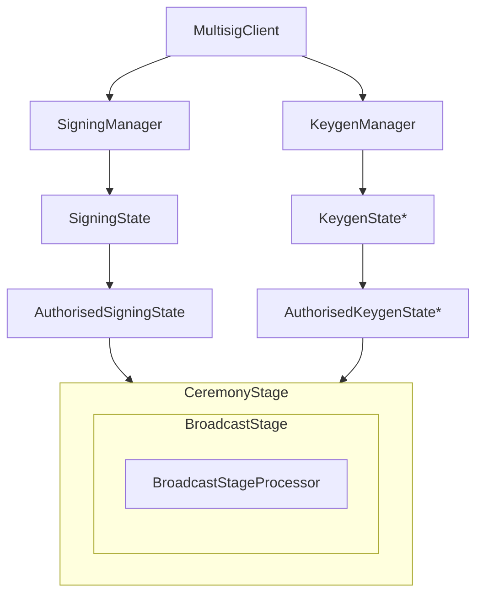
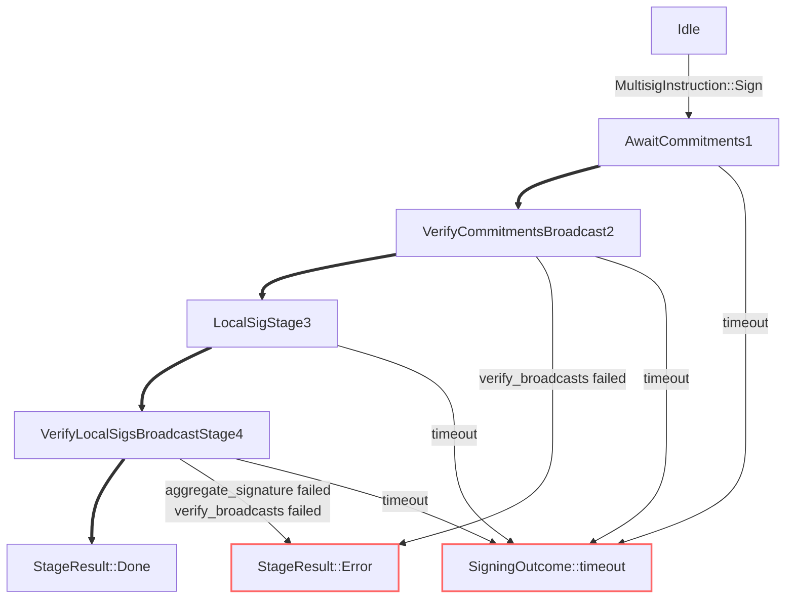

# Signing & Keygen

## `MultisigClient`

Receives `MultisigInstruction` and `P2PMessage` via channels.
Takes the `InnerEvent`s from its children and outputs a `P2PMessageCommand` or a `MultisigEvent` via channels.
Triggers cleanup every 10sec.



> *keygen is wip

## `SigningManager`

The `SigningManager` contains a `HashMap` of `SigningState`s with the `CeremonyId` as the key.
On a request to sign it checks:

- Correct number of signers
- We are one of the signers
- The signer ids are known for this key

## `SigningState`

The `SigningState` has an inner `AuthorisedSigningState` if the key is ready, else it will be `None` while it waits for the keygen to finish.
Holds `should_expire_at` for timeouts and `delayed_messages` for buffering the `CeremonyStage` messages that arrive early.
Checks for duplicate `ceremony_id`.

## `AuthorisedSigningState`

Contains the `CeremonyStage`, in the case if signing it is a `BroadcastStage`.

```mermaid
flowchart LR
    process_multisig_instruction -- MultisigInstruction::Sign --> on_request_to_sign
    process_p2p_message -- MultisigMessage::SigningMessage --> process_signing_data
    subgraph signing_states: HashMap<CeremonyId, SigningState>
        subgraph "AuthorisedSigningState (SigningState)"
            send_result
        end
        subgraph BroadcastStageProcessor
            init2[init] 
            process -- StageResult::NextStage --> init2
            process -- StageResult::Done --> send_result
            process -- StageResult::Error --> send_result
        end
        subgraph "BroadcastStage (CeremonyStage)"
            init
            process_message -- CollectedAll --> finalize --> process
            init --> init2
            init --> broadcast
            process_delayed --> process_message
            process_message -- Progress --> process_message
        end
    end
    subgraph SigningManager
        process_signing_data --> process_message
        on_request_to_sign --> init
    end
```

> Due to limitations with mermaid, the parent/child relationship is not strict in the flowchart.

## FROST Stages (`CeremonyStage`)


