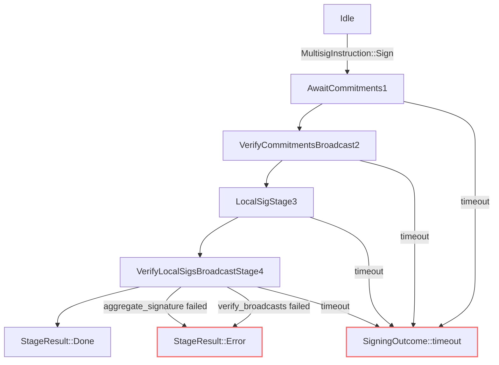

# WIP

## `FROST Stages`

```mermaid
graph TD;
Idle -- MultisigInstruction::Sign --> AwaitCommitments1
AwaitCommitments1 --> VerifyCommitmentsBroadcast2
VerifyCommitmentsBroadcast2 --> LocalSigStage3
LocalSigStage3 --> VerifyLocalSigsBroadcastStage4
VerifyLocalSigsBroadcastStage4 --> StageResult::Done

VerifyLocalSigsBroadcastStage4 -- aggregate_signature failed --> StageResult::Error
VerifyLocalSigsBroadcastStage4 -- verify_broadcasts failed --> StageResult::Error

AwaitCommitments1 -- timeout --> SigningOutcome::timeout
VerifyCommitmentsBroadcast2 -- timeout --> SigningOutcome::timeout
LocalSigStage3 -- timeout --> SigningOutcome::timeout
VerifyLocalSigsBroadcastStage4 -- timeout --> SigningOutcome::timeout

classDef Error stroke:#f66,stroke-width:2px;
class SigningOutcome::timeout,StageResult::Error Error
```