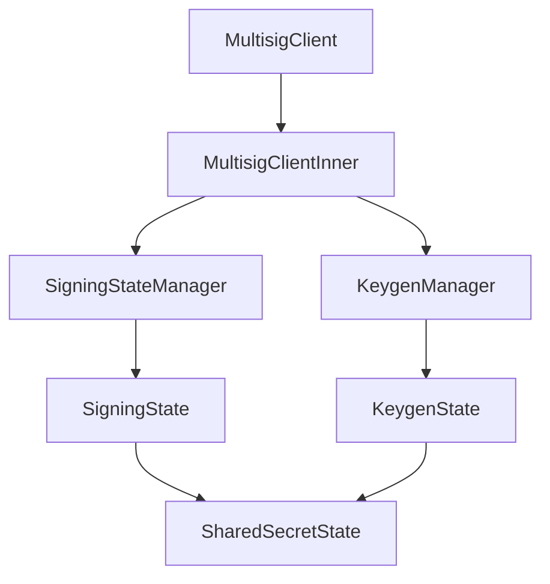
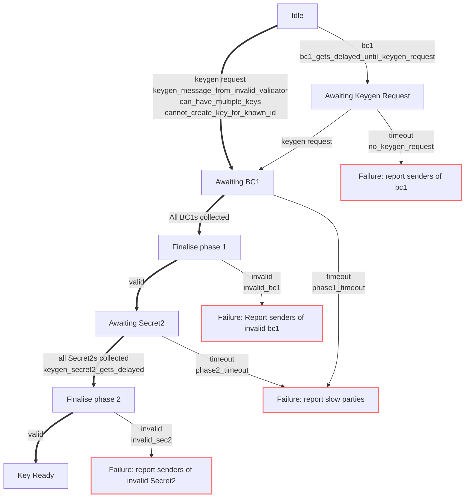
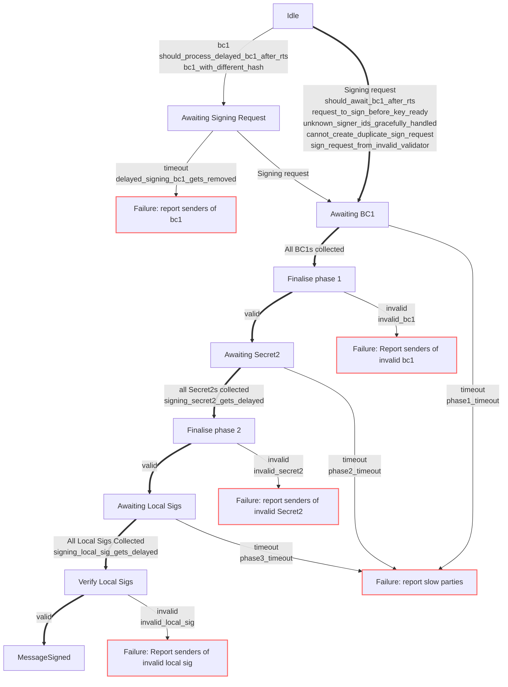

# Signing Module

The signing module facilitates the creation of a key that is shared by the chosen validators and then using a created key to sign stuff.

## Communicate with the other modules

### external communication

`MultisigClient` uses a channel with the `Subject::MultisigEvent` as the subject on all outgoing messages to the stream.
It subscribes to `P2PIncoming`, `MultisigInstruction`.
It publishes to `MultisigEvent` with a `ReadyToKeygen`,`ReadyToSign`,`MessageSigned` or `KeygenResult` message.

### Internal communication

`MultisigEvent` has a message that is an `InnerEvent`.
The `InnerEvent` is an enum with the relevant data to go to the `MultisigClientInner` and below.

### Structure diagram

>viewable in "markdown preview enhanced" VSCode extension or with "GitHub + Mermaid" chrome extension.

### `MultisigClient`

Async stuff and handles the message que to and from the channel.
Takes the `InnerEvent`s and publishes the relative `MultisigEvent`.
Uses the `InnerEvent::InnerSignal` to communicate with the internal modules below.

### `MultisigClientInner`

high level keygen and signing. Gets a `MultisigInstruction` message and does one of those 2 things.
Once a procedure is complete, it will send an `InnerEvent::InnerSignal` with the `KeyReady` or `MessageSigned` enum.

### `SigningStateManager`

Routes the messages to the correct `SigningState` process, so multiple signs can happen at once. 
Handles buffering/delaying bc1's if the `SigningState` does not exist for the sign request yet.
Runs a cleanup when told. The cleanup checks for timeouts.
If a timeout happens, the manager shows a warning, no blame is issued.

### `SigningState`

The `SigningState` takes the message and progresses the signing procedure using the `SharedSecretState`.
Once the `SharedSecretState` is done, it sends an `InnerEvent::SigningResult` with the outcome.
It also handles buffering incoming `Secret2`s and `LocalSig`s until the `SigningStage` in in the state to use them.

### `KeygenManager`

Routes the messages to the correct `KeygenState` process, so multiple keygens can happen at once.
Handles buffering/delaying bc1's if the `KeygenState` does not exist for the sign request yet.
Runs a cleanup when told. The cleanup checks for timeouts.
If a timeout happens, it sends the `InnerEvent` `KeygenOutcome::Timeout` or `KeygenOutcome::Unauthorised` with a list of the `bad_nodes` to blame.

### `KeygenState`

The `KeygenState` takes the message and progresses the Keygen procedure using the `SharedSecretState`.
Once the `SharedSecretState` is done, it sends an `InnerEvent::KeygenResult` with the outcome.
It also handles buffering incoming `Secret2`s until the `KeygenState` in in the state to use them.

## `SharedSecretState`

>viewable in "markdown preview enhanced" VSCode extension or with "GitHub + Mermaid" chrome extension.

### phase 1

So the `SharedSecretState` receives the bc1 broadcast from the other validators containing the `Broadcast1`,
Once it has received enough (share_count), it will put them in order and change its `StageStatus` to `Full`, ready for the next phase.
If the `SharedSecretState` gets a duplicate idx, it shows an error with the idx and goes to the Ignored `StageStatus`. The `SigningStage`/`KeygenStage` will ignore it and move on.

### phase 2

In Phase 2 it verifies the accumulated secrets and creates a `Secret2` for each validator.
Then sends the `Secret2` to each of the corresponding validators and stores its own secret.
If the verify was unsuccessful, it returns an error and relies on the parent to abandon the keygen.
We then wait for all the `shared_secrets` to come in from the other validators. Once full it will verify them and construct the key pair.
If it is valid then it will go to `SharedSecretStage::Done`.
Once again it relies on the parent to abandon the process if invalid.

### Local Sigs

If the `SharedSecretState` is being used by the `SingingState`, then `SingingState` will continue to the `AwaitingLocalSig3` after phase 2.
While in `AwaitingLocalSig3`  it collects the signatures from all of the validators and its self.
Once full, it aggregates them and verifies it using the aggregated public key generated in phase 2.
If the verification fails, it shows a warning and no blame is issued. (todo)

>Flow chart of message signing ceremony used by the `SigningState`. Also shows unit test names in links.

### bitcoin_schnorr.rs

Contains part of the Multisig Schnorr library. Implementation for `Keys`, `LocalSig` and `Signature`, used by the `SharedSecretState`.

### TODO

- Move todo list from `client_inner/tests/mod.rs` to here?
